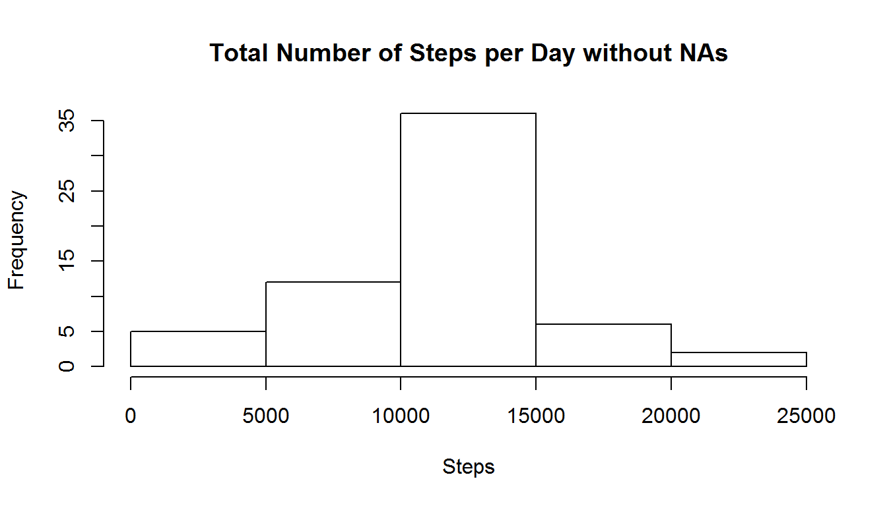
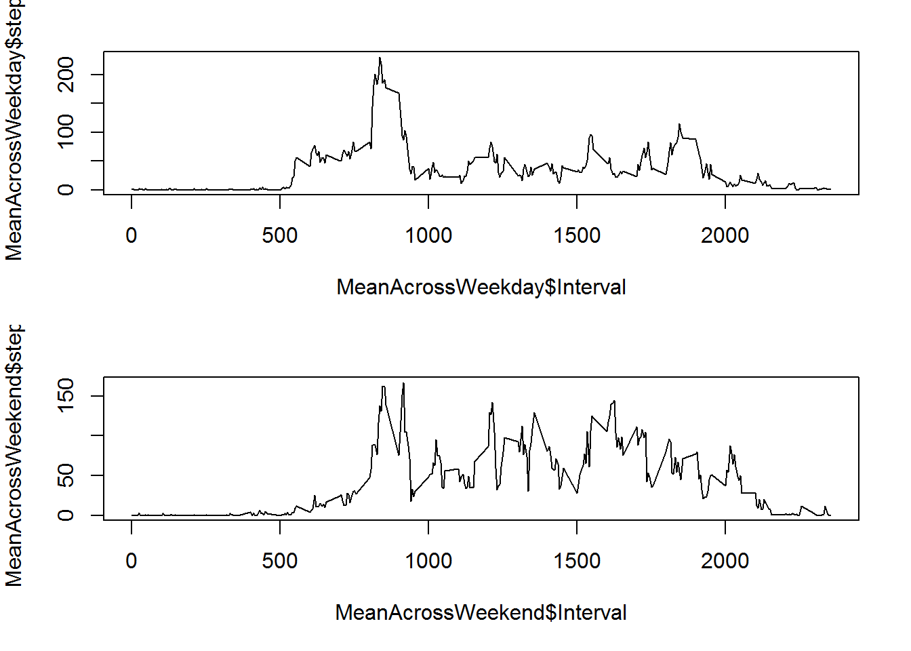

```{r opts, echo = FALSE}
knitr::opts_chunk$set(
  fig.path = "images/"
)
```


This is the report for the reproducible research first course project
keep_md: true
=====================================================================

First we load the data set from the working directory 

```{r}
data <- read.csv("activity.csv")
library(dplyr)
```

Here is the total number of steps taken per day plus its histogram
```{r , fig.height=4}
TotalSteps <- aggregate(data$steps, by=list(data$date), sum, na.rm=TRUE)
names(TotalSteps) = c("Date","Steps")
hist(TotalSteps$Steps,xlab = "Steps",main="Total Number of Steps per Day with NAs")
dev.copy(png,width = 480, height = 480, units = "px",("plot1.png"))
dev.off()
```


Here is the mean and median of the total number of steps taken per day
```{r}
meanStep <- mean(TotalSteps$Steps,na.rm=TRUE) 
medianStep <- median(TotalSteps$Steps,na.rm=TRUE) 
```

The mean is `r meanStep` and the median is `r medianStep`.

Here is a time series plot of the 5-minute interval (x-axis) and the average number of steps taken, averaged across all days (y-axis)

```{r, fig.height=4}
library(ggplot2)
MeanSteps <- na.omit(aggregate(data$steps, by=list(data$interval), mean, na.rm=TRUE)) 
names(MeanSteps) = c("Interval","Steps")
ggplot(data=MeanSteps, aes(x=Interval, y=Steps, group=1)) +geom_line()+ggtitle("Time series plot of the 5-minute interval with NAs")+ theme(axis.text.x = element_text(angle = 90, hjust = 1))
dev.copy(png,width = 480, height = 480, units = "px",("plot2.png"))
dev.off()
max <- MeanSteps$Interval[which.max(MeanSteps$Steps)]
```


The maximum number of steps for the 5-minute intervals, on average across all the days in the dataset, occurs on `r max`.

Let's calculate the total number of missing values in the dataset.
```{r}
totalNA <- sum(is.na(data$steps))
```

The total number of NAs is `r totalNA`


Here is a strategy for filling in all of the missing values in the datase:
All of the missing values are filled in with mean value for that 5-minute interval.
The new dataset is called newdata
```{r, fig.height=4}
targetsRows <- as.data.frame(which(is.na(data$steps)))
targetsInterval <- as.data.frame(data$interval[is.na(data$steps)])
newdata <- data
for ( i in 1 : nrow(targetsInterval)) {
        newdata[targetsRows[i,1],1] <- subset(MeanSteps,Interval==targetsInterval[i,1])$Steps
        
}
```

Here is the total number of steps taken each day plus the corresponding histogram. 
```{r, fig.height=4}
Total <- aggregate(newdata$steps, by=list(data$date), sum)
names(Total) = c("Date","Steps")
hist(Total$Steps,xlab = "Steps",main="Total Number of Steps per Day without NAs")
dev.copy(png,width = 480, height = 480, units = "px",("plot3.png"))
dev.off()
```



The calculaton of the mean and median of the total number of steps taken per day.
```{r}
TotalMean <- mean(Total$Steps)
TotalMedian <- median(Total$Steps)
```

The total mean per day after removing NAs is `r TotalMean` and the median is `r TotalMedian`. The new Mean and median values are higher after imputing missing data.

Are there differences in activity patterns between weekdays and weekends?
```{r}
days <- as.character(as.factor(c("Weekday","Weekend")))
newdata$day <- weekdays(as.Date(newdata$date))
weekends <- c("Saturday","Sunday")
for(i in 1 : nrow(newdata) ) {
        if(newdata$day[i] %in% weekends) {newdata$day[i] <- c("Weekend")} else {newdata$day[i] <- c("weekday")} 
} 
```

```{r}
MeanAcrossWeekday <- aggregate(subset(newdata,newdata$day=="weekday")$steps,by=list(subset(newdata,newdata$day=="weekday")$interval), mean)

names(MeanAcrossWeekday) <- c("Interval","steps")

MeanAcrossWeekend <- aggregate(subset(newdata,newdata$day=="Weekend")$steps,by=list(subset(newdata,newdata$day=="Weekend")$interval), mean)

names(MeanAcrossWeekend) <- c("Interval","steps")

par(mar=c(5,4,2,2))
par(mfrow=c(2,1))

plot(MeanAcrossWeekday$Interval,MeanAcrossWeekday$steps,type="l")

plot(MeanAcrossWeekend$Interval,MeanAcrossWeekend$steps,type="l")

dev.copy(png,width = 480, height = 480, units = "px",("plot4.png"))

dev.off()
```



